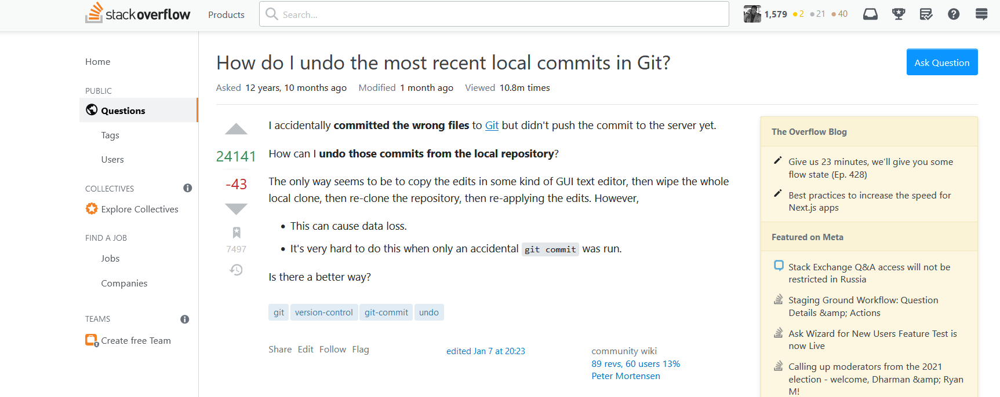

```{r setup, include=FALSE}
knitr::opts_chunk$set(echo = TRUE)
knitr::knit_hooks$set(error = function(x, options) {
  paste0("<pre style=\"color: red;\"><code>", x, "</code></pre>")
})
```


## Pointers

- R is free software
- Constructed and maintained by volunteers
- The R-spirit is kept alive by the community 

Remember : We (They) have limited time


## Golden Rule
 - The Golden Rule: Imagine You’re Trying To Answer The Question   

(And yes, this does smack somewhat of Matthew 7:12.)

***

Why do you ask a question ::  

 - Solve an existing problem   
 - Debug an error   
 - ....  
 
## Before you ask

1) Search, and research --> keep track of what you find.  
2) Write a title that summarizes the specific problem  
	- Remember you are talking to a busy colleague
	- Spelling, grammar and punctuation are important! (Impression)

***
	- Important to highlight what language and platform you’re using.   
   *The basics should usually be communicated through tags*  
   
{#id .class width=100% height=100%}

***	

```{r, error1, error=TRUE}
x <- "3"
x*2
```

	Examples:
	  Bad: multiplication error
	  Good: Why does x*2 evaluation in R return an error when x is set to "2"? 
	  
-  A question such as “Why doesn’t this work?” makes absolutely no sense  
 without the rest of the question.
 
***

3) Introduce the problem before you post any code (Well, what did you expect it to do? 
What are you trying to accomplish? What have you already tried? )
  
  - Expand on the summary put on the title
  - Explain the path to the problem
  - Explain the difficulties
  
```{}
I am trying to multiply an object in R but I get an evaluation error.
I first define an object `x="3"` then
multiply that by 2 as shown below. I tried ...
```

***

4) Help others reproduce the problem (Sample code and data)

 - Include some code if the problem is code related.  
   - NB: **don't just copy in your entire script!**
   - **Include just enough code to allow error reproducibility**  
 - Point out differences between your situation and other common ones
 - DO NOT post images of code, data, error messages, etc.
 
*** 
 
```{}
I am trying to multiply an object in R but I get an evaluation error. 
I first define an object `x="3"` then
multiply that by 2 as shown below. I tried ...

Below is the code I was working with. 
```
 
```{r , error2, error=TRUE}
x <- "3"
x*2
```
 
***

5) Proof-read before posting!

6) Look for help asking for help

7) Post the answer if you get it before someone answers. 


## Making a good impression 

- Register as a user and give yourself a meaningful name.  

{#id .class width=100% height=100%}

***

- Keep an eye on your question.

- Don’t add your own answer unless it really is an answer.

- There’s no need to include greetings and sign-offs 
  - such as “Hi everyone!” and “Thanks – hope to get an answer soon” in the question. 
- Above all, be polite. Remember that no-one is getting paid to answer your question. 


